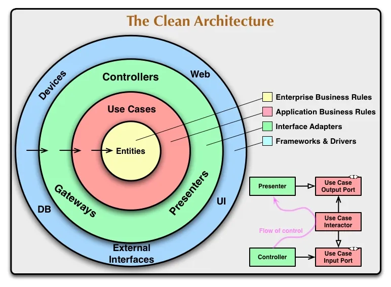

# Sobre o projeto:

Esse projeto visa o estudo e aplicação (usando linguagem Python) de conceitos relativos ao
Clean Architecture (arquitetura limpa).

Ele foi baseado em vários tutoriais e conteúdos obtidos via meio digital, todos referenciados no final desse documento.

# Requisitos para rodar os testes

- python (testado com a versão 3.10)
- pytest (versão especificada no arquivo 'requirements.txt')

Dicas:

- Crie um ambiente virtual para executar de forma isolada:
  
    $ pip3 install virtualenv

    $ virtulenv -p python3 .venv

    $ source .venv/bin/activate

- execução dos testes:
    
    $ pytest .

- Gerar MER atualizado:

    $ python3 generate_mer.py

# Noções de Clean Architecture

A arquitetura limpa visa, principalmente, a separação de tudo que é regra de negócio do que é externo a mesma.
Na teoria, a aplicação de um modelo de Clean architecture deveria ter:

- independência de framework
- independência de interface de usuário
- independência de banco de dados
- independência de qualquer elemento externo
- testabilidade

## Pontos positivos

- Separação da regra de negócio, encapsulamento da mesma.
  - Podemos fazer um parêntese com o 'S' do 'SOLID', pois estamos aplicando , de certa forma, o 'Single responsability principle' no contexto de arquitetura.

- As regras de negócio podem ser testadas sem a necessidade de uso de interfaces e devemos ter isso como norte, pois uma interface de acesso a aplicação pode mudar, por exemplo: antes via web, agora via console.

- Maior facilidade na troca de banco de dados, pois não é usada explicitamente uma lib para definição das regras de negócios atreladas ao banco.

- As regras de negócio não 'veem' o mundo externo. Com isso obtivemos uma visão front up .

## Pontos negativos

- Exige entendimento sobre o negócio e suas regras, para definição do core da aplicação.

- Possui maior complexidade inicial de aplicação.

## Entities (Domínio): 

Aqui estarão definidas todas as regras de negócio da aplicação, por exemplo:

Em uma aplicação de Lista de tarefas, poderíamos ter as seguintes entidades e suas regras:

- Entidade Item, que contém: título (maior que 3 letras), descrição (não obrigatória), prioridade (de 1 a 3)
- Entidade Lista, que contém: proprietário, items (lista de Item)

## User Case (Caso de uso)

Nesse local estabeleceremos alguns fluxos de uso para a aplicação em questão.
Aqui estarão regras de negócio na camada da aplicação, essas regras não alteram as regras já feitas nas entidades, mas as usam.

Em uma aplicação de Lista de tarefas, poderíamos ter os seguintes casos de uso:

- Criar Lista de tarefas
- Adicionar item a Lista criada previamente
- Completar lista de tarefas

##  Adaptadores de Interface - Controllers, Gateways, Presenters (comunicação)

Nessa camada podemos ter, desde serializadoras a repositorios de interação com bancos de dados.
No caso, vamos exemplificar um Gateway de persistência de dados (sem atrelar com nenhum banco propriamente dito):

- Gateway de persistência:
  - será uma interface
  - Terá três métodos
      - armazenar Item
      - deletar Item
      - listar todos Itens para uma Lista
   
Dessa maneira, seja qualquer a implementação (postgres, sqlite ou até armazenamento em memória com redis cache)
teremos esse gateway que define as interações desejadas.

# References

https://medium.com/luizalabs/descomplicando-a-clean-architecture-cf4dfc4a1ac6

https://www.alura.com.br/artigos/mer-e-der-funcoes

https://noplacelikelocalhost.medium.com/testing-crud-operations-with-sqlite-a-time-saving-guide-for-developers-7c74405d63d5

https://docs.sqlalchemy.org/en/20/orm/quickstart.html

https://fastapi.tiangolo.com/tutorial/sql-databases/

https://macoratti.net/21/10/net_cleanarch1.htm
